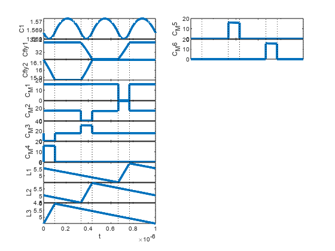

```matlab:Code
clear all
```

This example simulates the steady-state operation of a series-capacitor buck converter, neglecting deadtime effects, and examines selection of an optimal switching frequency for a fixed hardware implementation.

  

The series capacitor topology is under investigation is shown as an LTSpice schematic below


The topology is defined by a SPICE netlist.  In general, this can be saved from e.g. LTspice.  In this case, for the full netlist is written to a local .net file in the folowing code segment.

```matlab:Code
netlist = ['* SeriesCapBuck.asc' newline ...
'V1 N001 0 {Vg} Rser=1m' newline ...
'L1 N003 N004 {Lf}' newline ...
'C1 N004 0 {Cout}' newline ... 
'R1 N004 0 {Rout}' newline ...
'M1 N001 NC_02 N002 N002 NMOS ron = {ron} Coss = {Coss}' newline ...
'M2 N002 NC_01 N005 N005 NMOS ron = {ron} Coss = {Coss}' newline ...
'M3 N005 NC_03 N007 N007 NMOS ron = {ron} Coss = {Coss}' newline ...
'M4 N007 NC_04 0 0 NMOS ron = {ron} Coss = {Coss}' newline ...
'M5 N006 NC_05 0 0 NMOS ron = {ron} Coss = {Coss}' newline ...
'M6 N003 NC_06 0 0 NMOS ron = {ron} Coss = {Coss}' newline ...
'Cfly1 N002 N003 {Cfly}' newline ...
'Cfly2 N005 N006 {Cfly}' newline ...
'L2 N006 N004 {Lf}' newline ...
'L3 N007 N004 {Lf}' newline ...
'.end'];

fid = fopen( 'SeriesCapBuck.net', 'wt' );
fprintf( fid, netlist);
```

Note that all parameters of the converter are defined only parametrically.  The on-resistance of each FET is given value {ron} and the Coss capacitance {Coss}.  In order to simulate the topology, these parameters need to be given scalar values.  This can be done through ".param" statements in the netlist.  Alternatively, we the toolbox will look for definitions for all parameters in the MATLAB base workspace.  Using the latter approach, the parameters are defined below.

```matlab:Code
ron = 5e-3;
Coss = .2e-9;
Lf = 1e-6;
Cout = 20e-6;
Rout = .1;
Cfly = 2e-6;
Vg = 48;
```

The topology is then loaded into a simulation through the following.  The result in variable `sim` is an object of class SMPSim.

```matlab:Code
sim = SMPSim('SeriesCapBuck.net')
```

```text:Output
sim = 
  SMPSim with properties:

             Xs: []
      converter: [1x1 SMPSconverter]
             As: [12x12 double]
             Bs: [12x1 double]
             Cs: [12x12 double]
             Ds: [12x1 double]
             Is: [12x12 double]
       topology: [1x1 SMPStopology]
     stateNames: {12x1 cell}
    outputNames: {12x1 cell}
    switchNames: {'M1'  'M2'  'M3'  'M4'  'M5'  'M6'}
     inputNames: {'V1'}
             ts: []
              u: []
          swvec: [0 0 0 0 0 0]

```

By default, the toolbox loads a description of the toplogy with all switches *off*.  Thus, a single state space description is parsed with 12 states (6 MOSFET Coss capacitances, two flying capacitors, and oune output capacitor voltage, and three inductor currents),  12 outputs (all FET currents and voltages), and one input (input voltage).  

In order to simulate a steady-state SMPS converter, we need to define the class properties `ts`, `u`, and `swvec`.  Again, these can be defined as parameters in the netlist file, as variables in the MATLAB base workspace (when the circuit is loaded) or defined through a function call. as will be done later.

   -  `swvec `is a binary matrix that defines the switching sequency of the converter.  Each row defines a swithcing subinterval in which all switches (transistors, diodes) are either on or off.  The relative position (column index) of each switch corresponds to the ordering in the `switchNames` property of the SMPSim object, as shown above. 
   -  `ts` is a vector of the duration of each switching state corresponding to the rows of `swvec`. 
   -  `u` is the input vector defining all independent inputs to the system.  The relative position of each signal in the `u` vector corresponds to the `inputNames` property of the SMPSim object. 

```matlab:Code
swvec = [0 0 1 0 1 1;
    0 0 0 1 1 1;
    0 1 0 1 0 1;
    0 0 0 1 1 1;
    1 0 0 1 1 0;
    0 0 0 1 1 1;];

Ts = 1e-6;
D = .3;
ts = [D*Ts/3, (1-D)*Ts/3, D*Ts/3, (1-D)*Ts/3, D*Ts/3, (1-D)*Ts/3];

u = Vg;
```

These three are loaded into the simulation though the statements below.  Note that if these variables had been defined prior to the constructor call `SMPSim('SeriesCapBuck.net') `above, they would have been automatically loaded.

```matlab:Code
sim.converter.setSwitchingPattern(swvec,ts);
sim.u = u;
```

Now, with a complete converter, modulation, and input defined, the steady-state operation of the converter is soved via the following function call.  The output of this function is a matrix `Xs` which gives the state vecor **X **at the time instsant of each switching action.  The rows of the matrix corrspond to the state order specificed in the `stateNames` property of the SMPSim object, and the colums correspond to the switching actions, starting and ending with the initial and final states of the period (which are always equal in steady-state).

```matlab:Code
sim.steadyState
```

```text:Output
ans = 12x7    
    1.5687    1.5687    1.5687    1.5687    1.5686    1.5687    1.5687
   32.1537   32.1537   32.1537   31.8894   31.8878   32.1506   32.1537
   16.1339   15.8695   15.8680   16.1307   16.1338   16.1354   16.1339
   15.8741   15.8733   15.8715   16.1646   16.1347    0.0297   15.8741
   16.0172   16.3113   16.2831    0.0297   15.7593   31.8560   16.0172
   16.1314    0.0299   15.8734   31.8329   16.1313   16.1329   16.1314
   -0.0227   15.7855   -0.0280   -0.0272   -0.0253   -0.0245   -0.0227
    5.5672    5.4076    5.0352    4.8733    4.5015    5.9401    5.5672
    5.0333    4.8713    4.4996    5.9381    5.5652    5.4057    5.0333
    4.5350    5.9710    5.5980    5.4385    5.0661    4.9067    4.5350

```

For a more detailed look at the state waveforms, the `plotAllStates` function expands the discrete sample points into finely-sampled continuous time waveforms and plots them for visualization.

```matlab:Code
figure
sim.plotAllStates()
```



Another calculation of interest may be the efficiency of the converter.  In order to calculate this, we need the average input and output power of the converter in steady-state.  The average values of all states and outputs is solved with the following function

```matlab:Code
[avgXs, avgYs] = sim.ssAvgs();
```

The average output voltage is the average voltage on the output filter capacitor C1.  The average input current is equal to the average drain current in the MOSFET M1.  We find the indices of these signals in the respective vectors using the sigLoc function

```matlab:Code
VoutLoc = sim.sigLoc('C1','x');
IgLoc = sim.sigLoc('Im_M1','y');
```

Assuming small-ripple approximation applies on the output capacitor, the Input and Output powers and converter efficiency are then

```matlab:Code
Vout = avgXs(VoutLoc);
Ig = avgYs(IgLoc);
Pout = Vout^2/Rout;
Pin = Vg*Ig;

eta = Pout/Pin*100
```

```text:Output
eta = 96.4570
```

As an example minimal design sweep, we find the optimal switching frequency for this converter that maximizes efficiency by a brute force sweep.  As the switching frequency is changed, `converter.setSwitchingPattern(swvec,ts) `loads the new modulation pattern, and the efficiency is resolved.  Because only switching times are changing, there is no need to re-parse any of the state space descriptions.

```matlab:Code
fsrange = logspace(5,6,20);
for i = 1:length(fsrange)
    Ts = 1/fsrange(i);
    D = .3;
    ts = [D*Ts/3, (1-D)*Ts/3, D*Ts/3, (1-D)*Ts/3, D*Ts/3, (1-D)*Ts/3];

    sim.converter.setSwitchingPattern(swvec,ts);

    sim.steadyState;
    [avgXs, avgYs] = sim.ssAvgs();

    Vout = avgXs(VoutLoc);
    Ig = avgYs(IgLoc);
    Pout(i) = Vout^2/Rout;
    Pin(i) = Vg*Ig;
end
eta = Pout./Pin*100;

figure
yyaxis left
plot(fsrange,eta)
ylabel('Efficiency [%]')
yyaxis right
plot(fsrange,Pout)
xlabel('switching Frequency f_s [Hz]')
ylabel('P_{out} [W]')
```


```matlab:Code
[maxEta, optFs] = max(eta);
disp(['The maximum efficiency is ' num2str(maxEta) '% occuring at f_s = ' num2str(fsrange(optFs)/1000) ' kHz.'])
```

```text:Output
The maximum efficiency is 97.5028% occuring at f_s = 233.5721 kHz.
```

```matlab:Code
Ts = 1/fsrange(optFs);
D = .3;
ts = [D*Ts/3, (1-D)*Ts/3, D*Ts/3, (1-D)*Ts/3, D*Ts/3, (1-D)*Ts/3];
sim.converter.setSwitchingPattern(swvec,ts);
```

As a subsequent example, below we sweep through transistor implementations.  In this case, we keep the same switching frequency solved from the above parameters.  Using the `AURAdb()` included in the toolbox, tDB is a database of digitized transistor data.

Then, `Pout` and `Pin` are cleared from the previous results

```matlab:Code
tDB = AURAdb().transistors;

Pout = zeros(length(tDB),1);
Pin = zeros(length(tDB),1);
```

New values for all the transistors' ron and Coss are taken from each transistor part.  The `approx()` function uses typical values for each parameter, if available, or maximum/minimum if no typical is specified.  The `eqCap()` function solves a linear-equivalent capacitor using the nonlinear Coss-Vds curves of each device; in this case, the charge-equivalent capacitance is used.

```matlab:Code
for i = 1:length(tDB)
    ron = tDB(i).ron.approx();
    Coss = eqCap(tDB(i), 'Q', Vg/3);
```

With the new values for ron and Coss in the base workspace, we need to re-solve the numerical state space descriptions with the new values.  This can be done either by generating a whole new simulaiton object:

`    sim = SMPSim('SeriesCapBuck.net',swvec,u,ts);`

or, as is done below, we can keep the existing object but call the `loadCircuit` method of the topology along with the `force` flag set to one.  This forces the topology to re-parse the state space description even if it already has one stored for the switching state.  

```matlab:Code
    forceReload = 1;
    sim.topology.loadCircuit('SeriesCapBuck.net', swvec, forceReload);
    sim.converter.setSwitchingPattern(swvec,ts);
```

The remainder of the code in the for-loop is the same as the previous.

```matlab:Code
    sim.steadyState;
    [avgXs, avgYs] = sim.ssAvgs();

    Vout = avgXs(VoutLoc);
    Ig = avgYs(IgLoc);
    Pout(i) = Vout^2/Rout;
    Pin(i) = Vg*Ig;
end
eta = Pout./Pin*100;

figure
partNos = categorical({tDB(:).partNumber});
partNos = reordercats(partNos, {tDB(:).partNumber});        % Per MATLAB bar() documentation
bar(partNos, eta);
ylabel(['Efficiency at f_s = ' num2str(round(fsrange(optFs)/1000)) ' kHz'])
```


```matlab:Code
[maxEta, optDev] = max(eta);
disp(['At f_s = ' num2str(round(fsrange(optFs)/1000)) ' kHz, ' char(partNos(optDev)) ' has the maximum efficiency of ' num2str(maxEta) '% .'])
```

```text:Output
At f_s = 234 kHz, EPC2055 has the maximum efficiency of 97.4107% .
```

Using similar techniques, one could sweep devices individually, optimize both fs and device selection simultaneously, or incorporate a greater number of design parameters.
